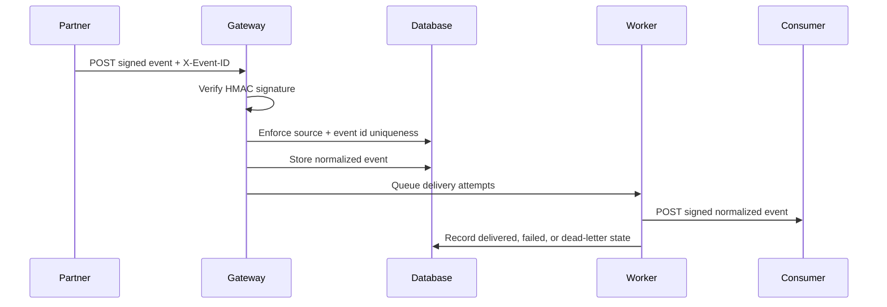

# Partner Integration Gateway

Portfolio API for receiving signed partner events, enforcing idempotency, normalizing payloads, and tracking outbound webhook delivery through failure and dead-letter states.

This repository was built from scratch with synthetic entities and generic integration patterns. It does not include private endpoints, client payloads, production credentials, organization-specific mappings, or copied business rules.

## What it demonstrates

- Public ingestion endpoint protected by HMAC SHA-256 signatures
- Per-source idempotency using `X-Event-ID`
- Generic event normalization into a stable internal envelope
- Organization-scoped JWT management APIs
- Outbound webhooks with independent signing secrets
- Delivery attempt tracking and dead-letter status after repeated failures
- Celery workers, PostgreSQL, Redis, Docker Compose, OpenAPI, tests, and CI

## Event flow



## Quickstart

```bash
cp .env.example .env
docker compose up --build -d
docker compose exec web python manage.py seed_demo
```

Open Swagger UI at `http://127.0.0.1:8000/api/docs/`.

Demo management user:

- Username: `demo-developer`
- Password: `demo1234`

## Send a signed synthetic event

Create the request body and signature using the demo inbound secret:

```bash
BODY='{"event_type":"artifact.ready","entity_id":"SYNTH-001","data":{"artifact":"manifest.csv"}}'
SIGNATURE=$(printf '%s' "$BODY" | openssl dgst -sha256 -hmac 'demo-inbound-secret' -hex | awk '{print $2}')

curl -X POST http://127.0.0.1:8000/api/ingest/synthetic-source/ \
  -H "Content-Type: application/json" \
  -H "X-Event-ID: event-001" \
  -H "X-Signature: $SIGNATURE" \
  -d "$BODY"
```

Sending the same `X-Event-ID` again returns the existing event instead of creating a duplicate.

## Management endpoints

- `POST /api/auth/token/`
- `GET /api/me/`
- `GET/POST /api/sources/`
- `GET/POST /api/subscriptions/`
- `GET /api/events/`
- `GET /api/deliveries/`

## Local validation

```bash
python -m venv .venv
source .venv/bin/activate
pip install -r requirements.txt
python manage.py migrate
python manage.py test
python manage.py spectacular --file /tmp/openapi.yaml --validate
```

## Security notes

- Demo signing secrets are intentionally non-production values.
- A production implementation should store partner secrets in a managed secret store or KMS.
- Payloads, URLs, mappings, and identifiers in this project are synthetic.
